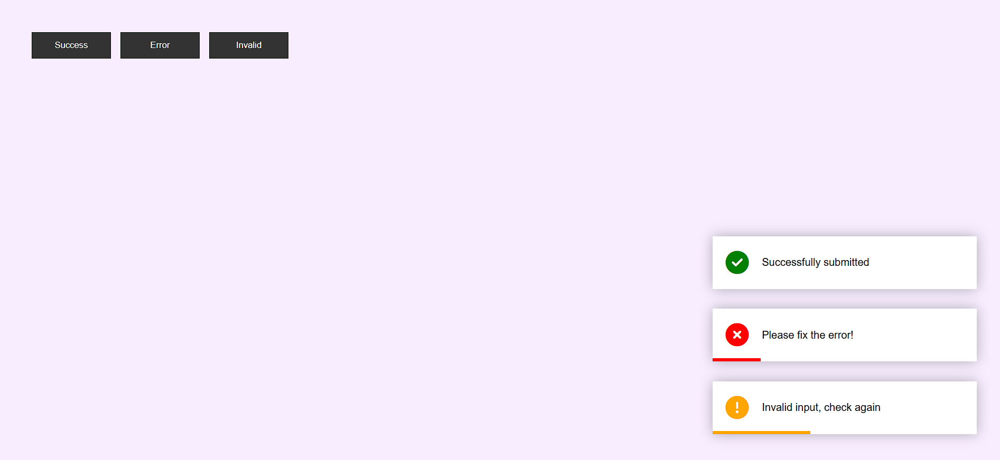

# Toast Notifications Project

This is a simple and stylish Toast Notification system built using HTML, CSS, and JavaScript. It provides interactive success, error, and invalid messages with animated visual feedback using Font Awesome icons.

## 🚀 Features

- Three types of notifications: Success, Error, and Invalid Input.
- Smooth animation with colored progress bars.
- Font Awesome icons for better UX.
- Responsive and easy-to-integrate UI component.

## 📸 Screenshot

  

## 🛠️ How to Use

1. **Clone or Download the Project**

git clone https://github.com/yourusername/toast-notifications.git

2. **Open `index.html` in a browser**

No server setup is required, as it's a front-end only project.

3. **Click the buttons** to see the toast notifications in action.

## 🧠 Technologies Used

- HTML5
- CSS3
- JavaScript
- [Font Awesome](https://fontawesome.com/)

## ✨ Preview

You can see the live preview in supported environments or locally by opening `index.html`.

## 📌 Notes

- The toast automatically disappears after 6 seconds.
- The bottom colored bar indicates the duration before the toast disappears.

## 📄 License

This project is licensed under the MIT License.

---

💡 Feel free to customize the toast styles and durations according to your project needs!

